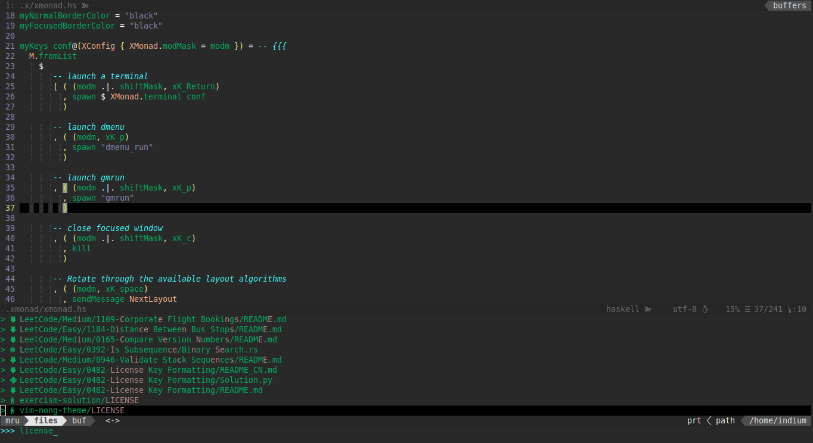

#  vim-nong-theme
[中文](./README_CN.md)

## Installation
### [vim-plug](https://github.com/junegunn/vim-plug/)
```vim
Plug 'fruit-in/vim-nong-theme'
```
```vim
:PlugInstall
```

### [Vundle.vim](https://github.com/VundleVim/Vundle.vim/)
```vim
Plugin 'fruit-in/vim-nong-theme'
```
```vim
:PluginInstall
```

### Manually
```shell
$ wget https://raw.githubusercontent.com/fruit-in/vim-nong-theme/master/colors/nong.vim -P ~/.vim/colors
```

## Usage
Add the following to your `~/.vimrc`:
```vim
colorscheme nong
syntax on
```

## Screenshots
<br>
<br>
<br>

